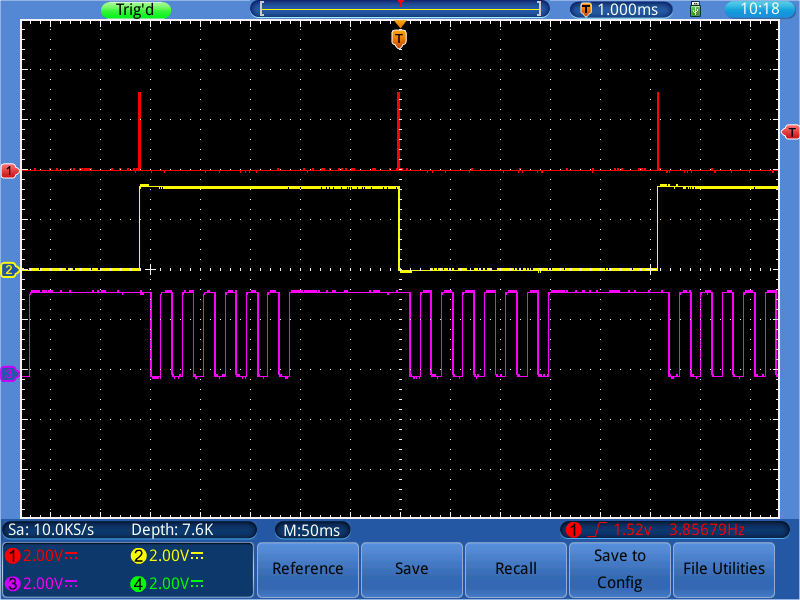
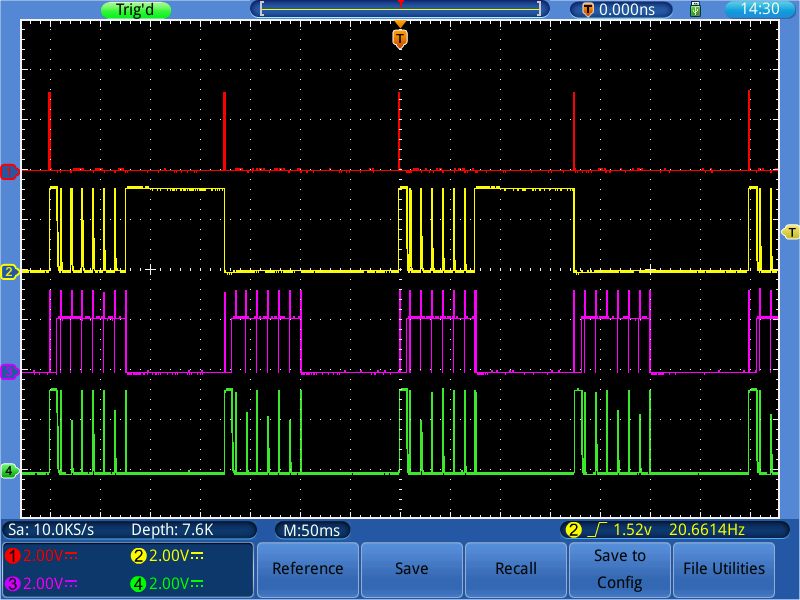

# ULP Loop Example

The purpose of this application is to test retaining of RTC IO output signals during hibernation of ESP32.

## How it works

Initially the application configures three GPIOs that perform the following functions:

1. GPIO25 - is set high when the main program is active, low when in sleep
2. GPIO26 - toggled on each wakeup of the main program
1. GPIO4  - is set high when ULP program is active, low when in sleep
3. GPIO27 - toggled on each wakeup of ULP

Then the main program is sequentially put to sleep and then woken up by ULP. This process is reflected by status of GPIO25 and GPIO26.

During sleep of the main program, ULP is also put to sleep and then periodically restarted by ULP timer. Each period of activity and sleep of ULP is signaled by asserting GPIO4 high and toggling of GPIO27. Period of restarts of ULP from sleep is configured by setting number of clock cycles in `SENS_ULP_CP_SLEEP_CYC0_REG` register. Effectively ULP is sleeping for 10 ms.

After specific number of restarts of ULP (configured using the constant value `toggle_cycles_to_wakeup` inside `loop_blink.S`), the ULP timer is disabled and the main program woken up.

When up, after asserting of GPIO25 and GPIO26 the main program is put back to sleep, ULP is started again and the process continues.

What is special about this application?

Nothing, besides you need to enable holding of last state of specific output before you put chip into hibernation mode. To do so, use function `rtc_gpio_hold_en(gpio_num_t gpio_num)`. There is also equivalent `rtc_gpio_hold_dis(gpio_num_t gpio_num)` function to disable holding the last state once chip wakes up and you need to change the output.

Enabling and disabling hold of pins from ULP program is a little bit more tricky. Instead of using a single function you need to set specific bits in specific registers that depend on the pin number / type. Fortunately there is a table `rtc_gpio_desc` where you can lookup all RTC IO pins and bits. Check for it in file [rtc_module.c](https://github.com/espressif/esp-idf/blob/98e15df7f6af8f7f26f895b31e18049198dcc938/components/driver/rtc_module.c#L46) of ESP-IDF repository on GitHub.

## Example output on scope

Trace of correctly configured output looks like below:



	1. Red / GPIO25 - is set high when the main program is active, low when in sleep
	2. Yellow / GPIO26 - toggled on each wakeup of the main program
	3. Violet / GPIO4 - is set high when ULP program is active, low when in sleep
	3. Green / GPIO27 - toggled on each wakeup of ULP

RTC IO output signals are retained as expected during hibernation mode.

If you put chip into hibernation mode and forget to configure hold of pin status, then result will look as follows: 



When the output is set high and chip put into hibernation mode, then output goes low as there is no power delivered to hold it on. It is visible as violet (GPIO27) and yellow (GPIO26) spikes. Chip in hibernation state is just conserving power and you need consciously configure peripherals that should be on.

## Example output on console

Note: GPIO15 is connected to GND to disable ROM bootloader output.

```
ULP wakeup, printing status
CPU / ULP toggle counter 0x68 / 0x348
Entering deep sleep

ULP wakeup, printing status
CPU / ULP toggle counter 0x69 / 0x350
Entering deep sleep

ULP wakeup, printing status
CPU / ULP toggle counter 0x6a / 0x358
Entering deep sleep
```
